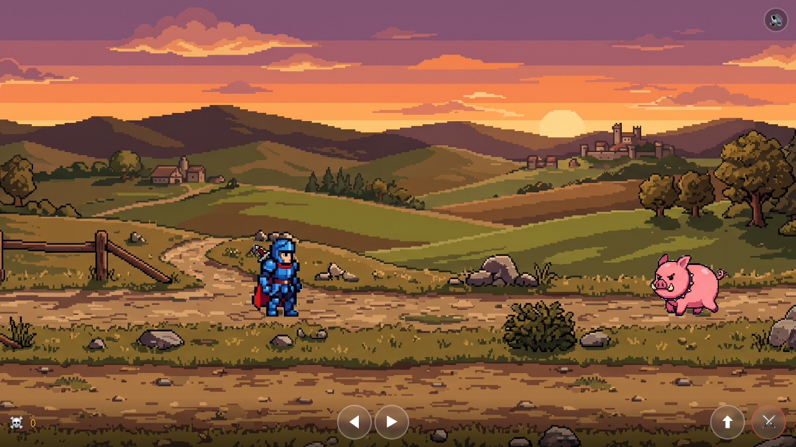
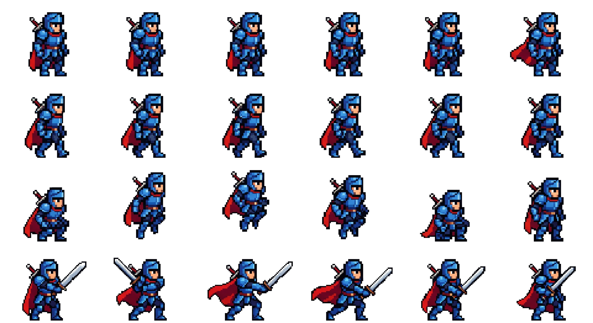
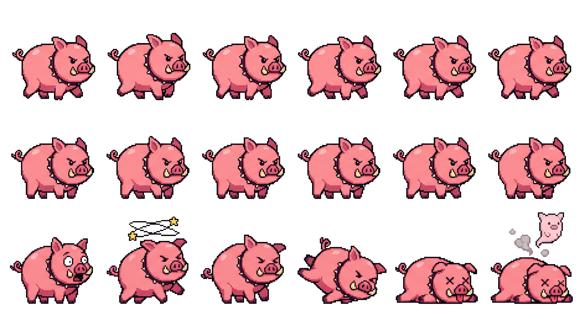

# 🗡️ Pendekar Versus Babi

A pixel art action game built with HTML5 Canvas — a medieval knight fights pig monsters with sword slashes, jumping, and sound effects.

**Purpose:** Learning repo for sprite animation — from AI-generated sprite sheets to game-ready animation loops.

---

## 🎮 Gameplay



- **Knight** (blue armor) — move, jump, slash
- **Pig Monster** — spawns every ~10s, walks toward you
- **2-hit kill:** 1st slash → pig stunned (⭐ dizzy), 2nd slash → pig dies (💀)
- **Sound effects:** footstep clanks, sword whoosh, pig grunts, cartoon impacts

### Controls
- **← →** — Move
- **↑ / Space** — Jump
- **Z** — Sword attack
- **🔊 button** — Toggle sound

### Play locally
```bash
python3 -m http.server 8765
```
Then open the URL shown in your terminal.

---

## 🔄 Full Workflow: How to Build a Sprite Animation Game from Scratch

### Phase 1: Design the Character & Animations

Before generating anything, define:

1. **Character design** — What does the character look like? (colors, style, proportions)
2. **Animation list** — What animations do you need?
3. **Grid layout** — How many columns × rows?
4. **Frame count per animation** — 6 frames is a good default for smooth pixel art
5. **Style** — 16-bit SNES pixel art, white background, no grid lines

Example for our knight:
- Blue plate armor, silver sword, SNES style
- 4 animations: idle, walk, jump, attack
- 6 frames each → 6×4 grid = 24 frames total
- Row 0: idle, Row 1: walk, Row 2: jump, Row 3: attack

### Phase 2: Generate Sprite Sheet with AI

#### Option A: Gemini (Nano Banana)
- **Cost:** ~$0.03/image
- **Speed:** ~10s
- **Best for:** Fast iteration, expressive characters
- **Watch out:** Grid alignment can be off (7 cols instead of 6), frame offsets

```bash
# Using Gemini API directly or any Gemini-based image generation tool
# Generate with this prompt:
```

**Prompt for knight:**
```
16-bit SNES style pixel art sprite sheet of a medieval knight in blue plate armor with silver sword, 6 columns by 4 rows grid on white background. Row 1: idle standing pose 6 frames. Row 2: walking animation 6 frames. Row 3: jumping animation 6 frames. Row 4: sword attack slash animation 6 frames. Each frame shows the character in the same center position with only the moving parts changing. White background #FFFFFF, no grid lines, no labels, no text.
```

**Prompt for pig monster:**
```
16-bit SNES style pixel art sprite sheet of a pig monster, 6 columns by 3 rows grid on white background. Row 1: walk cycle 6 frames showing pig walking with legs moving. Row 2: death animation 6 frames showing pig getting hit, surprised, dizzy with stars, falling down, and becoming a ghost. Each frame shows the pig in the same center position with only the moving parts changing. White background #FFFFFF, no grid lines, no labels, no text.
```

#### Option B: GPT Image 2
- **Cost:** ~$0.04/image (medium) / ~$0.17/image (high quality)
- **Speed:** ~15-25s
- **Best for:** Precise grid counts, better alignment
- **Watch out:** High quality 1536×1024 may timeout on slow connections

```python
from openai import OpenAI
import os

client = OpenAI(api_key=os.environ.get('OPENAI_API_KEY'))

result = client.images.generate(
    model="gpt-image-2",
    prompt="16-bit SNES style pixel art sprite sheet of a medieval knight in blue armor, 6 columns by 4 rows...",
    size="1536-1024",
    quality="high",
)
```

**Comparison:**

| | Gemini | GPT Image 2 |
|---|---|---|
| Grid precision | Sometimes 7 cols instead of 6 | Exact 6×4 ✅ |
| Frame alignment | Max ~55px offset | Near-perfect ✅ |
| Cost | ~$0.03 | ~$0.04–$0.17 |
| Speed | ~10s | ~15-25s |
| Expressiveness | 9/10 | 8/10 |
| Grid accuracy | 7/10 | 9.5/10 |

**Recommendation:** Use GPT Image 2 for final sprite sheets (precise grids), Gemini for fast iteration and concept art.

### Phase 3: Post-Process — Make Background Transparent

AI models can't reliably produce clean transparent backgrounds. Always post-process:

```python
from PIL import Image
import numpy as np

img = Image.open('sprite.png').convert('RGBA')
data = np.array(img)
# Detect near-white pixels (tolerance for anti-aliasing)
white = (data[:,:,0] > 240) & (data[:,:,1] > 240) & (data[:,:,2] > 240)
data[white] = [0, 0, 0, 0]  # Make transparent
Image.fromarray(data).save('transparent-sprite.png')
```

### Phase 4: Auto-Alignment (if needed)

When AI generates frames with inconsistent character positioning:

```python
# For each frame cell in the grid:
# 1. Find bounding box of non-transparent pixels
# 2. Calculate center of mass of the character
# 3. Shift character to the cell's center
# 4. Reassemble into aligned sprite sheet
```

### Phase 5: Generate Background

Use any image generation tool with a prompt like:
```
16-bit SNES pixel art medieval landscape background, rolling hills with a stone castle on the right, small village on the left, dirt path through green meadow, sunset sky with orange and purple clouds, no characters, wide panorama
```

### Phase 6: Generate Sound Effects

Using [ElevenLabs Sound Effects API](https://elevenlabs.io/sound-effects):

```bash
# Set your API key
export ELEVENLABS_API_KEY=your_key_here
python3 gen_sfx.py
```

**All SFX prompts used:**

| Sound | Prompt | Duration |
|-------|--------|----------|
| Knight walk | "Heavy armored knight footsteps on dirt, metal boot clanking, chainmail jingle, medieval soldier walking" | 0.5s |
| Knight jump | "Knight jumping upward with heavy armor, whoosh, metal clank, energetic leap" | 0.6s |
| Knight attack | "Sword slash, metal blade swinging through air, sharp whoosh, medieval weapon attack, powerful strike" | 0.8s |
| Pig walk (loop) | "Pig grunting and oinking continuously, realistic farm pig sounds, rhythmic grunting snorting, oink oink grunt grunt, ongoing pig vocalizations" | 5.0s |
| Pig stunned | "Cartoon hit impact, thud, boing, character getting dazed, dizzy sound effect" | 0.6s |
| Pig die | "Cartoon pig defeat, squeal, poof, puff of smoke, comedic death sound effect" | 1.0s |

**Tip for looping sounds:** Generate at least 5s duration, apply fade in/out with ffmpeg for seamless loop:
```bash
ffmpeg -i raw.mp3 -af "afade=t=in:st=0:d=0.15,afade=t=out:st=4.7:d=0.3" -t 5 loop.mp3
```

### Phase 7: Build the Game (HTML5 Canvas)

Key implementation decisions:

1. **Pre-slice frames on load:** Cut sprite sheet into individual `<canvas>` elements for fast blitting
2. **Animation loop logic:**
   - Idle/walk = loop forever
   - Jump/attack = play once → return to idle
3. **Pig state machine:** walking → stopped (near knight) → stunned (1st hit, loops dizzy frames) → dying (2nd hit, plays death frames once)
4. **Z-order:** Knight drawn first, pig on top
5. **Hit detection:** Check overlap between sword swing area and pig bounding box, only on specific attack frames (frames 2-4)

### Phase 8: Mobile Optimization

- **Canvas DPR:** Cap `devicePixelRatio` at 1.5 — pixel art doesn't need retina resolution
- **Audio:** Use HTML5 `<audio>` elements, not Web Audio API. Unlock on first `touchstart`/`click`
- **Touch controls:** Large circular buttons with `touch-action: manipulation`
- **Portrait layout:** Ground line at 68% height (vs 72% landscape) for more play area

---

## 🎨 Sprite Sheets

### Knight (6×4 grid)


| Row | Animation | Frames | Loop? |
|-----|-----------|--------|-------|
| 0 | Idle | 6 | ✅ Loop |
| 1 | Walk | 6 | ✅ Loop |
| 2 | Jump | 6 | ❌ Play once → idle |
| 3 | Attack | 6 | ❌ Play once → idle |

### Pig Monster (6×3 grid)


| Row | Animation | Frames | Loop? |
|-----|-----------|--------|-------|
| 0 | Walk | 6 | ✅ Loop (while moving) |
| 1 | Walk (duplicate) | 6 | — unused |
| 2 | Death/Stun | 6 | ❌ Play once |

---

## 📐 Architecture

```
┌─────────────────────────────────────┐
│           index.html                 │
│  ┌───────────┐  ┌────────────────┐  │
│  │  Canvas    │  │  <audio> SFX   │  │
│  │  (render)  │  │  (HTML5 play)  │  │
│  └─────┬─────┘  └────────────────┘  │
│        │                              │
│  ┌─────▼──────────────────────────┐  │
│  │       Game Loop (60fps)         │  │
│  │  Knight state → draw knight    │  │
│  │  Pig state    → draw pig       │  │
│  │  Hit detect   → play SFX       │  │
│  └────────────────────────────────┘  │
└─────────────────────────────────────┘
```

---

## 📂 File Structure

```
├── index.html                      # Main game
├── transparent-old-knight.png       # Knight sprite (6×4)
├── transparent-nb-pig-monster.png   # Pig sprite (6×3)
├── bg-medieval.png                  # Background
├── sfx-knight-walk.mp3              # Knight footsteps
├── sfx-knight-jump.mp3              # Knight jump
├── sfx-knight-attack.mp3            # Sword slash
├── sfx-pig-walk.mp3                 # Pig grunting (loop)
├── sfx-pig-stunned.mp3              # Pig bonked
├── sfx-pig-die.mp3                  # Pig defeated
├── gen_sfx.py                       # SFX generation script
├── LICENSE                          # MIT
├── docs/                            # Screenshots + docs assets
│   ├── game-screenshot.png
│   ├── knight-spritesheet.png
│   └── pig-spritesheet.png
└── README.md
```

---

## 🧠 Key Learnings

1. **Prompt engineering for sprite sheets:** Explicitly specify grid dimensions, background color, and "same position, only moving parts change" — without this, AI produces unusable sheets
2. **GPT Image 2 > Gemini for grids:** More precise column/row counts, better alignment
3. **Transparency is always post-processing:** AI models can't produce clean transparent backgrounds — always strip with PIL/numpy
4. **Mobile performance:** Cap canvas DPR, pre-slice frames into individual canvases, avoid per-frame drawImage from large sheets
5. **Mobile audio:** Web Audio API fails on mobile — use HTML5 `<audio>` with user-gesture unlock
6. **2-hit kill design:** Separate `stunned` and `dying` states with different sprite rows + SFX creates satisfying gameplay feel
7. **Looping SFX:** Generate ≥5s clips, fade in/out with ffmpeg for seamless HTML5 audio loop
8. **Animation state machine:** Clear separation of looping vs one-shot animations prevents bugs
